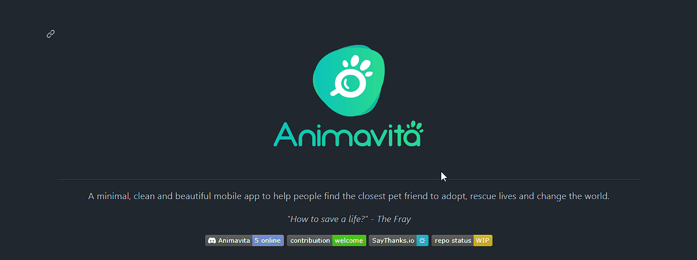

# Projeto com README
Um projeto de teste com um arquivo README 😎



## Tecnologias Utilizadas
- HTML
- CSS
- JS

## Como Utilzar

1- Clone o projeto
```
 git clone
``` 

2- Acesse a página do projeto
```
 cd repositorio-com-readme
``` 